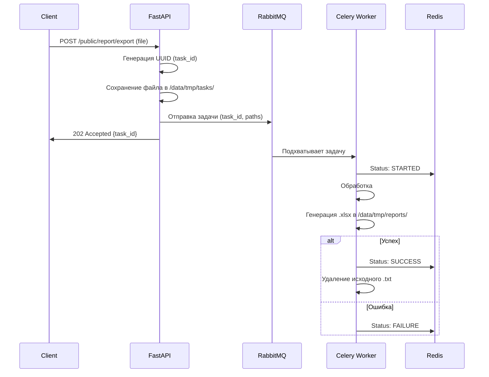

# Word Frequency Analyzer (Test Task)

Сервис для анализа частотности словоформ в текстовых файлах с генерацией отчетов в формате Excel.

## Содержание

- [Word Frequency Analyzer (Test Task)](#word-frequency-analyzer-test-task)
  - [Содержание](#содержание)
  - [Технологический стек](#технологический-стек)
  - [Запуск](#запуск)
  - [Архитектура решения](#архитектура-решения)
    - [Процесс обработки (Sequence Diagram)](#процесс-обработки-sequence-diagram)
  - [Особенности реализации](#особенности-реализации)
  - [Тестирование](#тестирование)
  - [Эндпоинты](#эндпоинты)

## Технологический стек

- Backend: FastAPI
- Фоновые задачи: Celery + RabbitMQ
- Хранение статусов: Redis
- Анализ текста: Pymorphy3
- Генерация Excel: XlsxWriter

## Запуск

```bash
cp .env.example .env
docker compose up --build
```

После запуска документация доступна по адресу: `http://localhost:8000/docs` и `http://localhost:8000/redoc`

---

## Архитектура решения

Проект реализован с соблюдением принципов DDD и чистой архитектуры:

- Domain: Лемматизация (`Pymorphy3`) и логика подсчета слов.
- Application (Use Cases): Оркестрация процесса генерации отчета.
- Infrastructure: Чтение и запись файлов.

### Процесс обработки (Sequence Diagram)



---

## Особенности реализации

1. Обработка больших файлов:

- Стриминг: Файлы читаются построчно через генераторы, что позволяет обрабатывать большие файлы на с небольшим RAM.
- XlsxWriter Optimization: Используется режим `constant_memory: True`, что позволяет записывать огромные таблицы напрямую на диск, не накапливая их в памяти.

2. Масштабируемость: Благодаря Celery, API остается доступным для других пользователей даже во время тяжелых вычислений.

- _Примечание:_ Текущая версия сфокусирована на русском языке. Английские слова учитываются, но к нормальной форме не приводятся.

---

## Тестирование

Для проекта написан набор тестов:

```bash
docker compose exec -it api pytest
```

---

## Эндпоинты

- `POST /public/report/export` — Принимает `.txt` файл. Возвращает `task_id`.
- `GET /public/report/status/{task_id}` — Возвращает статус обработки (`PENDING`, `STARTED`, `SUCCESS`, `FAILURE`).
- `GET /public/report/download/{task_id}` — Отдает готовый `.xlsx` файл.
