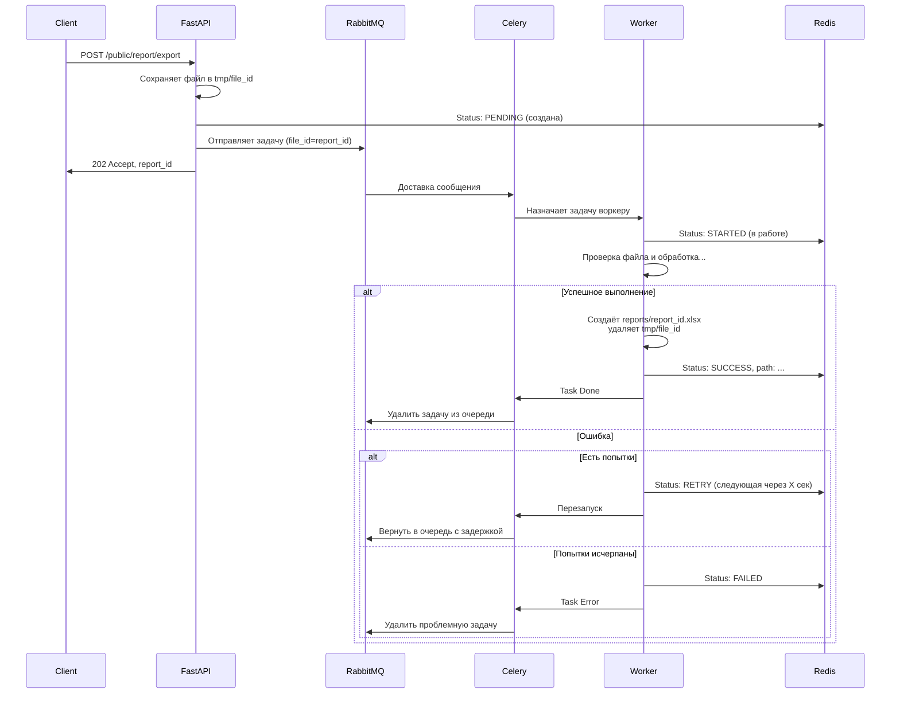
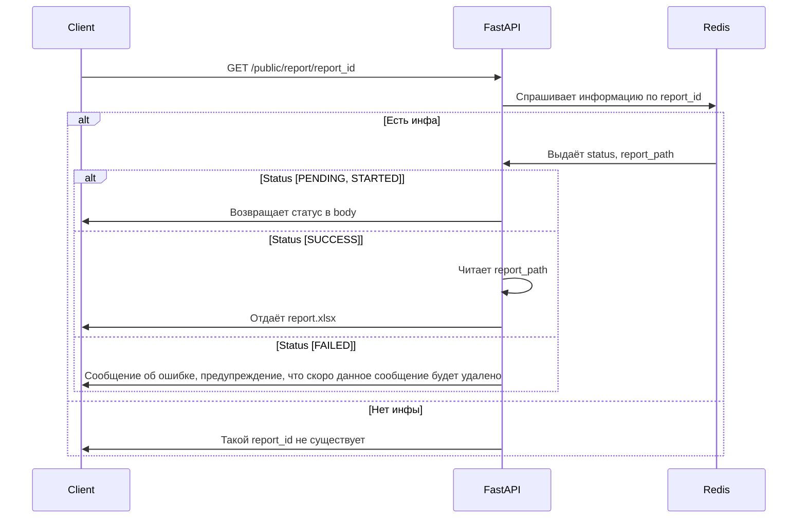

# План

pandas (или аналог типа openxls, ибо pd может жрать много памяти) - для составления таблиц
fastapi - для presentation
celery - для оркестрации процессами
rabbitmq - брокер сообщений
redis - для хранения мета-инфы о процессе решения задачи

пример обработки:

пример получения файла:

<!-- !! В тз ничего не сказано про язык, в примере есть только русский, стоит указать в README потом. 
Хотя я английские слова пропускаю (тоже считаю, но к нормальной форме не привожу)
-->